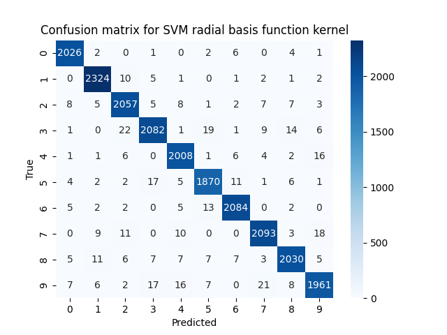

\newpage

# Kompensationsarbeit SVM

github_url: https://github.com/Niklas-Maderbacher/SVM-Komp

## Theorie Support Vector Machine

Support Vector Machine ist ein Klassifizierungsalgorithmus, der einfach gesagt eine Trennlinie zwischen Objekten zieht und dementsprechend so neue Objekte einer Gruppe zuordnet.


Wenn die Objekte jedoch nicht linear trennbar sind, muss ein **Kernel Trick** angewandt werden.

### Linearer Kernel

Bei dieser Methode werden die Objekte in eine höhere Dimension angehoben und es wird statt einer Trennlinie eine Hyperplane gezogen.


\newpage

### Radial Basis Function Kernel

Bei dieser Methode wird die Ähnlichkeit zwischen zwei Objekten gemessen. Je ähnlicher zwei Objekte sind, deste näher ist der Kernelwert bei 1, je unähnlicher desto näher bei 0.

## Umsetzung Support Vector Machine

### Verwendete Bibliotheken

```python
from sklearn.datasets import fetch_openml
from sklearn.svm import SVC
from sklearn.metrics import classification_report, confusion_matrix
from sklearn.model_selection import train_test_split

from werkzeug.utils import secure_filename

import matplotlib.pyplot as plt
import seaborn as sns

import time
```

| Name der Bibliothek | Nutzen |
|---------------------|--------|
| sklearn.datasets | Bibliothek um den **mnist_784** Datensatz zu laden |
| sklearn.svm | Bibliothek um ein vorgefertigtes SVM Modell zu importieren |
| sklearn.metrics | Bibliothek um die SVM zu beurteilen |
| sklearn.model_selection | Bibliothek um den geladenen Datensatz in Trainings- und Testdaten zu teilen |
| werkzeug.utils | Bibliothek um eine sichere Speicherung des Ergebnisses zu gewährleisten |
| matplotlib.pyplot | Bibliothek um das Ergebnis der SVM graphisch darzustellen |
| seaborn | Bibliothek um das Ergebnis der SVM graphisch darzustellen |
| time | Bibliothek um die Dauer des Trainingsvorgangs zu messen |

### Datensatz laden

```python
x, y = fetch_openml("mnist_784", return_X_y=True)
```

Mit der Funktion **fetch_openml** wird der mnist_784 Datensatz geladen

\newpage

### Feature Scaling

```python
x = x / 255.0
```

Da die Pixel der Zahlen zwischen weiß und schwarz, also zwischen 0 und 255, muss der Wert auf einen Wert zwischen 0 und 1 skaliert werden, um Verfälschungen anhand der großen Distanz zu vermeiden.

### Aufteilen in Test- und Trainingsdaten

```python
x_train, x_test, y_train, y_test = train_test_split(
    x, y, test_size=0.3, random_state=361
)
```

Hier werden die Test- und Trainingsdaten im Verhältnis 70%/30% aufgeteilt

### Support Vector Machine mit linearem Kernel

```python
svm_lin = SVC(kernel="linear")
svm_lin.fit(x_train, y_train)
```

Hier wird das Support Vector Machine Modell mit dem linearen Kernel trainiert.

### Support Vector Machine mit RBF Kernel

```python
svm_rbf = SVC(kernel="rbf")
svm_rbf.fit(x_train, y_train)
```

Hier wird das Support Vector Machine Modell mit dem Radial Basis Function Kernel trainiert.

\newpage

### Modell evaluieren

```python
def eval_model(model: SVC, x_test, y_test, title: str):
    y_pred = model.predict(x_test)
    print(f"Evaluation for model: {title}")
    print("Classification report:")
    print(classification_report(y_test, y_pred))

    con_matrix = confusion_matrix(y_test, y_pred)
    sns.heatmap(con_matrix, annot=True, fmt="d", cmap="Blues")
    plt.title(f"Confusion matrix for {title}")
    plt.xlabel("Predicted")
    plt.ylabel("True")
    plt.savefig(f"figures/{secure_filename(title)}.png", format="png")
    plt.close()


eval_model(svm_lin, x_test, y_test, "SVM linear kernel")
eval_model(svm_rbf, x_test, y_test, "SVM radial basis function kernel")
```

Hier wird das Modell evaluiert. Zuerst wird das Ergebnis (y) mittels des Modells bestimmt und anschließend wird dieses Ergebnis (y_pred) mit dem Tatsächlichen Wert (y_test) verglichen und die Genauigkeit bestimmt. Um die Evaluierung einfach darzustellen, wird eine Matrix erstellt und mittels Heatmap visualisiert.

\newpage

## Diskussion Ergebnis

### Trainingszeit Linearer Kernel

Das Training für die SVM mit linearem Kernel dauerte **113.67** Sekunden.

### Genauigkeit Linearer Kernel

{ height=50% }

| Klasse | Precision | Recall | F1-Score | Support |
|--------|-----------|--------|----------|---------|
|   0    |   0.95    |  0.98  |   0.96   |  2042   |
|   1    |   0.95    |  0.98  |   0.96   |  2346   |
|   2    |   0.91    |  0.93  |   0.92   |  2103   |
|   3    |   0.91    |  0.90  |   0.91   |  2155   |
|   4    |   0.92    |  0.96  |   0.94   |  2045   |
|   5    |   0.91    |  0.90  |   0.91   |  1919   |
|   6    |   0.96    |  0.95  |   0.96   |  2113   |
|   7    |   0.95    |  0.95  |   0.95   |  2144   |
|   8    |   0.94    |  0.89  |   0.91   |  2088   |
|   9    |   0.94    |  0.90  |   0.92   |  2045   |

| Spalte | Definition |
|--------|------------|
| precision | wie viele der als **<number>** erkannten Bilder tatsächlich eine **<number>** waren |
| recall | wie viele der **<number>** Bilder korrekt erkannt wurden |
| f1-score | Kombination aus precision und recall |
| support | Wie viele **<number>** Bilder im Datensatz waren |

\newpage

### Trainingszeit RBF Kernel

Das Training für die SVM mit Radial Basis Function Kernel dauerte **116.20** Sekunden.

### Genauigkeit RBF Kernel

{ height=50% }

| Klasse | Precision | Recall | F1-Score | Support |
|--------|-----------|--------|----------|---------|
|   0    |   0.98    |  0.99  |   0.99   |  2042   |
|   1    |   0.98    |  0.99  |   0.99   |  2346   |
|   2    |   0.97    |  0.98  |   0.97   |  2103   |
|   3    |   0.98    |  0.97  |   0.97   |  2155   |
|   4    |   0.97    |  0.98  |   0.98   |  2045   |
|   5    |   0.97    |  0.97  |   0.97   |  1919   |
|   6    |   0.98    |  0.99  |   0.99   |  2113   |
|   7    |   0.98    |  0.98  |   0.98   |  2144   |
|   8    |   0.98    |  0.97  |   0.97   |  2088   |
|   9    |   0.97    |  0.96  |   0.97   |  2045   |

| Spalte | Definition |
|--------|------------|
| precision | wie viele der als **<number>** erkannten Bilder tatsächlich eine **<number>** waren |
| recall | wie viele der **<number>** Bilder korrekt erkannt wurden |
| f1-score | Kombination aus precision und recall |
| support | Wie viele **<number>** Bilder im Datensatz waren |

\newpage

### Fazit

Die Trainingsdauer mit RBF Kernel dauert etwas länger als mit dem linearen Kernel jedoch ist die Genauigkeit mit dem RBF Kernel höher als mit dem linearen Kernel.

Bei den Zahlen 3, 5, 8 und 9 hatte das Modell Schwierigkeiten das richtige Ergebnis zu liefern.

\newpage

## Quellen

- https://scikit-learn.org/stable/modules/generated/sklearn.datasets.load_digits.html
- https://en.wikipedia.org/wiki/MNIST_database
- https://jasoneliu.github.io/pessoalab/mnist/mnist_sklearn.html
- https://www.geeksforgeeks.org/machine-learning/understanding-scikit-learns-svc-decision-function-and-predict/
- https://de.wikipedia.org/wiki/Support_Vector_Machine
- https://en.wikipedia.org/wiki/Radial_basis_function_kernel